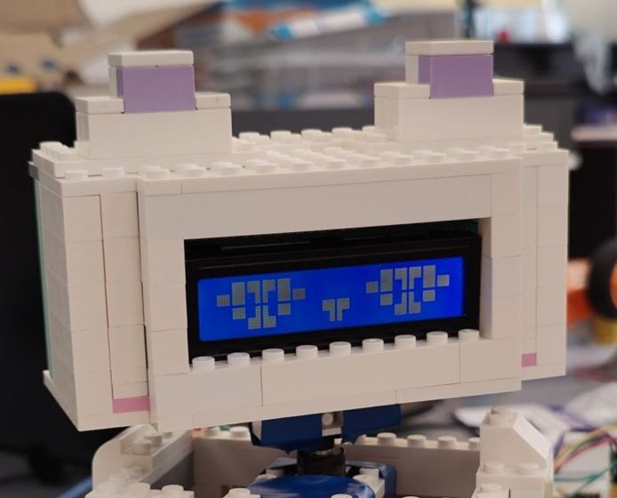
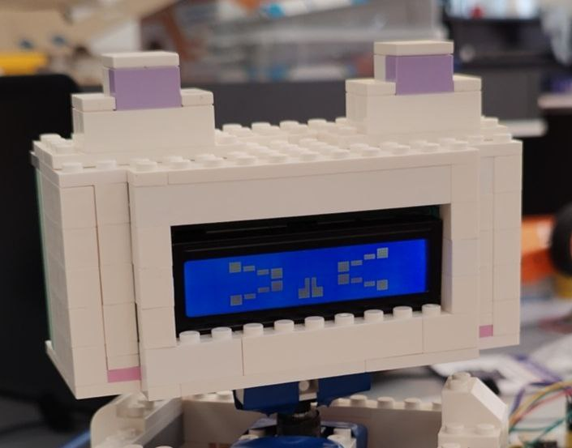

# Дисплей

### Описание

Светодиод - это прекрасно и красиво, но с помощью одной лампочки практически невозможно передать какую-то информацию. Тут на помощь могут прийти различные типы **дисплеев**:

<figure><figcaption></figcaption></figure>

Мы рассмотрим LCD-дисплей.

Такие дисплеи можно встретить старых торговых автоматах, на кассе в магазине (на такие дисплеи часто выводится сумма вашей покупки), офисной технике и т.д.&#x20;

Дисплей прост для программирования - встроена библиотека символов, то есть не нужно выводить буквы попиксельно, можно выводить сразу буквы или даже создать свои символы (подробнее, например, [тут](https://app.gitbook.com/u/qDZ4174xWSgbxLiR1bR9bEH6QJs1) или [тут](https://alexgyver.ru/lcd-plots-and-bars/)) показывать анимацию.

<details>

<summary>Пример с кастомными символами - робот-котик</summary>


<figure><figcaption></figcaption></figure>

<figure><figcaption></figcaption></figure>

<figure><figcaption></figcaption></figure>

</details>

Такой дисплей - универсальный вариант для вывода отладочной информации с устройства, создания текстового меню для управления и так далее.


LCD-дисплеи бывают разных размеров, у нас - 1602 (16 символов, 2 строки) и 2004 (20 символов, 4 строки).

Важно! Сам по себе такой экран требует для подключения 6 цифровых пинов, но в продаже есть переходник на шину I2C на базе PCF8574, что сильно упрощает подключение и экономит пины. Именно такие переходники мы и используем, они припаяны с обратной стороны дисплеев.

### Схема подключения

<figure><figcaption></figcaption></figure>

### Код программы

Напишем программу, которая выводит на экран надпись “Hello World!”.

Начнем с подключения библиотеки: Чтобы подключить библиотеку, нажимаем Sketch -> Include Library -> ищем нужную в списке. Нам нужна библиотека LiquidCrystal\_I2C.

<figure><figcaption></figcaption></figure>

После этого в начале кода появится строчка, которая и нужна для использования библиотеки в программе:

```arduino
#include <LiquidCrystal_I2C.h>
```

Самая первая вещь, которую нужно сделать – инициализировать экран в программе. Это делается с помощью команды LiquidCrystalI2C, далее записывается любое название экрана, его адрес и количество столбцов (символов) и строк:

```arduino
LiquidCrystal_I2C ekran(0x27, 16, 2);
```

Внутри функции `setup` нам нужно запустить экран (`ekran.init()`), подсветку экрана (`ekran.backlight()`):

```arduino
void setup() {
  ekran.init();         // инициализация экрана
  ekran.backlight();    // включить подсветку
}
```

Чтобы вывести символы на экран, нужно сначала:

* установить курсор в нужную «ячейку» командой `ekran.setCursor(столбец, строка)`
* вывести текст командой `ekran.print(“текст”)`

<figure><figcaption></figcaption></figure>

Код (внутри `loop`):

```arduino
ekran.setCursor(0, 0);
ekran.print("Hello World!");
```

Для работы с экраном так же есть и другие полезные функции:

```arduino
setCursor(x, y); // курсор на (столбец, строка)
clear(); // очистить дисплей
home(); // аналогично setCursor(0, 0)
noDisplay(); // отключить отображение
display(); // включить отображение
blink(); // мигать курсором на его текущей позиции
noBlink(); // не мигать
cursor(); // отобразить курсор
noCursor(); // скрыть курсор
scrollDisplayLeft(); // подвинуть экран влево на 1 столбец
scrollDisplayRight(); // подвинуть экран вправо на 1 столбец
backlight(); // включить подсветку
noBacklight(); // выключить подсветку
createChar(uint8_t, uint8_t[]); // создать символ
createChar(uint8_t location, const char *charmap); // создать символ
```

### Задания для самостоятельного выполнения

#### Задание 1

Напишите программу, которая выводит на экран 3 разных слова/фразы по очереди с паузой в 1.5 секунду

#### Задание 2

Подключите две кнопки. Напишите программу, которая:

* При нажатии на кнопку 1 выводит фразу 1
* При нажатии на кнопку 2 выводит фразу 2
* Если ни одна кнопка не нажата, очистить экран
