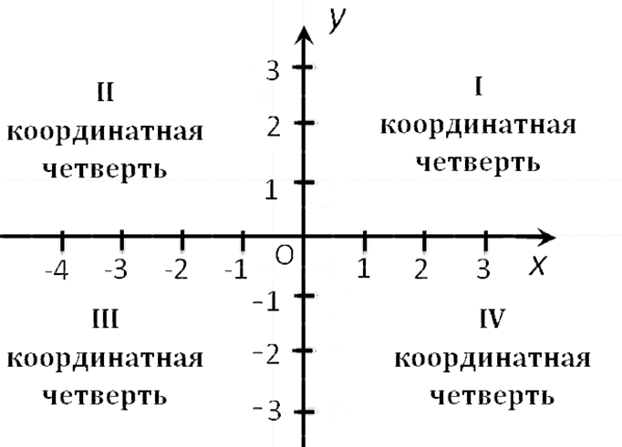

# 2 Условия и случайные данные

## Теория

### Условия в python

Оператор if в Python используется для выполнения определенных действий только при соблюдении определенных условий.

Вот такие есть операторы для проверки условий:

* \== равно
* \>больше&#x20;
* < меньше&#x20;
* <= меньше или равно&#x20;
* \>= больше или равно&#x20;
* != не равно

Синтаксис `if` такой: условие, которое нужно проверить, записывается после оператора `if`, за которым следует двоеточие `:` На следующей строке, отступив 4 пробела (или 1 tab), указываем действия, которые будут выполняться при выполнении условия:

```python
password = "securepassword123" # пусть это значение нашего пароля
if password == "securepassword123": # если пароль равен этому значению
    print("Ты молодец!") # то вывести надписи
		print("Пароль принят")
```

Отступы на 3 и 4 строке указывают, что эти команды находятся "внутри" if-а, то есть они выполнятся только при выполнении условия if:

<figure><figcaption></figcaption></figure>

Пример программ с if и разными операторами. Посмотрите и разберите каждую строчку - зачем она нужна и что делает?

Пример 1 - температура с датчика:

```python
temperature = int(input())

if temperature < 18:
    print("❄️ Холодно!")
elif temperature > 25:
    print("🔥 Жарко!")
else:
    print("✅ Комфортно")
```

Пример 2 - сравнение чисел:

```python
num1 = int(input())                   # считываем первое число
num2 = int(input())                   # считываем второе число
if num1 < num2:
    print(num1, 'меньше чем', num2)
if num1 > num2:
    print(num1, 'больше чем', num2)
if num1 == num2:                      # используем двойное равенство
    print(num1, 'равно', num2)
if num1 != num2:
    print(num1, 'не равно', num2)
```

### Задачи:

1\) Что покажет этот код?

```python
language = 'English'
if language == 'English':
    print('Hello!')
print('Язык по умолчанию:', language)
```

2\) При регистрации на сайтах требуется вводить пароль дважды. Это сделано для безопасности, поскольку такой подход уменьшает возможность неверного ввода пароля.

Напишите программу, которая сравнивает пароль и его подтверждение. Если они совпадают, то программа выводит текст «Пароль принят» (без кавычек), иначе – «Пароль не принят» (без кавычек).

3\) Арифметическая прогрессия - числовая последовательность вида

.png>)

Формула члена прогрессии:     .png>)

Напишите программу, которая определяет, являются ли три заданных числа (в указанном порядке) последовательными членами арифметической прогрессии.

На вход программе подаются три целых числа, каждое на отдельной строке.

Программа должна вывести «YES» (без кавычек) или «NO» (без кавычек) в соответствии с условием задачи.

### Логические операторы

Как быть в ситуации, когда у нас есть несколько условий? В Python есть три логических оператора, которые позволяют создавать сложные условия:

* and — логическое умножение;&#x20;
* or — логическое сложение;
* not — логическое отрицание.

Скорее всего, эти операторы вам уже известны, но если хотите вспомнить, посмотрите [тут](https://myrobot.ru/python/02_logic_operators.php)

Пример программы с операторами and и not:

```python
if temperature > 25 and humidity > 70:
    print("Душно!")
    
if not is_sensor_ok:
    print("Датчик неисправен")
```

Еще один пример программы. По координатам точки, не лежащей на осях координат, определяет номер координатной плоскости, в которой она находится:

<figure><figcaption></figcaption></figure>

```python
x = int(input())
y = int(input())
if x > 0 and y > 0:
    print('1 четверть')
if x < 0 and y > 0:
    print('2 четверть')
if x < 0 and y < 0:
    print('3 четверть')
if x > 0 and y < 0:
    print('4 четверть')
```

Задачи:

1\) Что покажет этот код?

```python
river1 = 'Волга'
river2 = 'Эльба'
print(river1 == 'Буг' and river2 == 'Одер')
print(river2 != 'Эльба' or river1 != 'Лена')
```

2\) Напишите программу, которая принимает целое число X и определяет, принадлежит ли данное число указанным промежуткам.

<figure><figcaption></figcaption></figure>

3\) Назовём число красивым, если оно является четырёхзначным и делится нацело на 7 или на 17. Напишите программу, определяющую, является ли введённое число красивым. Программа должна вывести «YES» (без кавычек), если число является красивым, или «NO» (без кавычек) в противном случае.

4\) Напишите программу, которая принимает на вход число и в зависимости от условий выводит текст «YES» (без кавычек) либо «NO» (без кавычек).

Условия:

* если число нечётное, то вывести «YES»;
* если число чётное в диапазоне от 2 до 5 (включительно), то вывести «NO»;
* если число чётное в диапазоне от 6 до 20 (включительно), то вывести «YES»;
* если число чётное и больше 20, то вывести «NO».

### Генерируем случайные данные

Часто для разных задач, напримеро, для проверки логики работы программы, может понадобиться сгенерировать случайные значения. Сделать это можно с помощью модуля random. Чтобы использовать его, в начале кода нужно прописать import random.

Вот какие в нем есть функции:

* `random()`: генерирует случайное число от 0.0 до 1.0

Функция random() возвращает случайное число с плавающей точкой в промежутке от 0.0 до 1.0. Если же нам необходимо число из большего диапазона, скажем от 0 до 100, то мы можем соответственно умножить результат функции random на 100.

Например:

```python
import random
 
number = random.random()  # значение от 0.0 до 1.0
print(number)
number = random.random() * 100  # значение от 0.0 до 100.0
print(number)
```

* `randint()`: возвращает случайное число из определенного диапазона

Функция `randint(min, max)` возвращает случайное целое число в промежутке между двумя значениями min и max.

* `randrange()`: возвращает случайное число из определенного набора чисел
* `shuffle()`: перемешивает список
* `choice()`: возвращает случайный элемент списка

Вот пример, как можно использоват модуль random, чтобы сымитировать датчик:

```python
import random

temp = random.randint(15, 35)  # случайное целое от 15 до 35
print(f"Температура: {temp}°C")
```

### Задание

1\) Используйте код, который остался у вас с предыдущего урока. Замените все значения показаний датчика (температура, влажность, давление) на рандомные (в диапазонах, соотвествующих реальным)

2\) Добавьте индикацию по температуре. Создайте переменную "Статус климата" (status). Если температура <5\*C, то status = "Холодно". Если температура >5 и <30, то status = "Нормально". Если температура >25, то status = "Жарища".&#x20;

Выводите статус отдельной строкой или в одной строке с температурой в \*C

**Дополнительно:** раскрасьте текст статуса в 3 разных цвета с помощью colorama, в зависимости от значения

## Практика

### Статистика

Создайте новый файл climat\_control.py.&#x20;

Написать программу, которая делает 10 измерений температуры (сгенерировать случайно в адекватном диапазоне), сохраняет все значения в память и в конце выводит статистику: сколько было измерений, среднее, минимальное и максимальное значение.

Для того, чтобы вручную не генерировать 10 измерений, можно использовать цикл for. Сделать, например, какое-нибудь действие 10 раз, можно так:

```python
for i in range(10):
    # действия которые должны повторяться
```

Например, так можно вывести числа от 0 до 9:

```python
for i in range(10):
    print(i)
```

Для того, чтобы не хранить 10 температур в 10 отдельных переменных, можно использовать массив (в питоне то, что мы знаем как массивы, называют _списки_). Создать пустой список можно так:

```python
temperatures = []
```

а добавить к нему значение (в конец списка) вот так:

```python
temperatures.append(значение)
```

Со списками можно сделать много чего, например, одной командой найти сумму значений, макс и мин значения... Посмотрите [тут ](https://pythonworld.ru/tipy-dannyx-v-python/spiski-list-funkcii-i-metody-spiskov.html)или [тут](https://skillbox.ru/media/code/spiski-v-python/) для подробностей

### График

Создать текстовую гистограмму, где каждое измерение температуры отображается в виде полоски из символов. Чем выше температура — тем длиннее полоска.

В качестве кусочка полоски можно использовать такие символы: █ или ░

&#x20;В прошлой задаче вы уже получили 10 значений температуры, а так же макс и мин значения. Пусть макс значение - это 10 х █, (то есть ██████████) а мин - это 1 х █. Пересчитайте для каждого значения температуры, сколько нужно квадратиков ? И выведите график. Еще его можно раскрасить, ведь █ - это такой же символ, как и A B 4 и т.д...

### Создаем аварию

Написать программу, которая генерирует случайные температуры до тех пор, пока не выпадет значение «АВАРИЯ» (температура выше 30°C). Программа должна посчитать, сколько попыток потребовалось. Дополнительно: сохранить все температуры до выпадения аварии и вывести их тоже)

Здесь нам понадобится цикл while. Можно сделать его с условием (действия внутри цикла повторяются, пока выполняется условие):

```python
while (условие):
    # действия
```

например, считаем до 5, когда досчитали, выводим радостное сообщение:

```python
a = 0 # нужно инициализировать переменную до цикла
while a < 6:
    print(a)
    a += 1 # прибавляем 1 к текущему значению
print("Ура досчитали")
```

Или можно создать бесконечный цикл и выходить из него по условию, которое находится уже внутри (в теле) этого цикла:

```python
a = 0
while True:
    a +=1
    print(a)
    if (a > 4):
        break;
print("Ура досчитали")
```

Еще про циклы for и while: [тут](https://pythonworld.ru/osnovy/cikly-for-i-while-operatory-break-i-continue-volshebnoe-slovo-else.html) и [тут](https://skillbox.ru/media/code/tsikly-v-python-kak-rabotayut-i-kakie-byvayut/)

