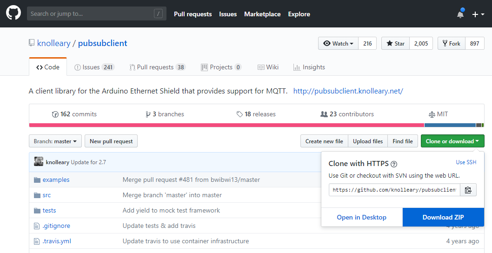

# Подготовка рабочего места

Мы будем использовать Arduino IDE 2. Все инструкции по настройке справедливы для Arduino IDE 1 (интерфейс отличается незначительно). Вы можете выполнять задания в любой среде, в том числе в Visual Studio Code + Platformio, однако в этом случае этап установки плат и библиотек будет отличаться. Используйте гугл!

Узнать, что вообще есть в Arduino IDE, можно тут:



Запустите Arduino IDE и откройте окно **Файл -> Настройки (File -> Preferences)**. Введите "[https://arduino.esp8266.com/stable/package\_esp8266com\_index.json](https://arduino.esp8266.com/stable/package_esp8266com_index.json)" в строку "**Дополнительные ссылки для менеджера плат**" (Additional boards manager URLs).

<figure><figcaption></figcaption></figure>

Откройте менеджер плат из меню **Инструменты -> Плата -> Менеджер плат (Tools -> Board -> Boards Manager).** В появившейся слева панели в строке поиска введите "**esp8266**" и установите поддержку esp8266 **версии 2.5.2**

<figure><figcaption></figcaption></figure>

<figure><figcaption></figcaption></figure>

Для работы с MQTT потребуется установить библиотеку [https://github.com/knolleary/pubsubclient](https://github.com/knolleary/pubsubclient)

Для этого нужно:

1. Скачать репозиторий как ZIP

<figure><figcaption></figcaption></figure>

2. Установить библиотеку в среду Arduino с помощью меню **Скетч -> Подключить библиотеку -> Добавить ZIP библиотеку (Sketch -> Include Library -> Add .ZIP Library)**

<figure><figcaption></figcaption></figure>

Дфлее нужно выбрать архив библиотеки из файлов. Архив будет находиться там, куда вы его скачали. Вероятнее всего это папка "Загрузки".

Если все в порядке, в терминале Output в нижней части Arduino Ide появится надпись "Library installed"

Как вы уже поняли, мы работаем с платой WeMos D1 mini, поэтому прежде чем продолжить, выберем ее в меню **Инструменты -> Плата -> esp8266 -> LOLIN (WEMOS) D1 R2 & mini   (Tools -> Board -> esp8266 -> LOLIN (WEMOS) D1 R2 & mini)**

.png>)

Готово! Можно загружать первую программу.
